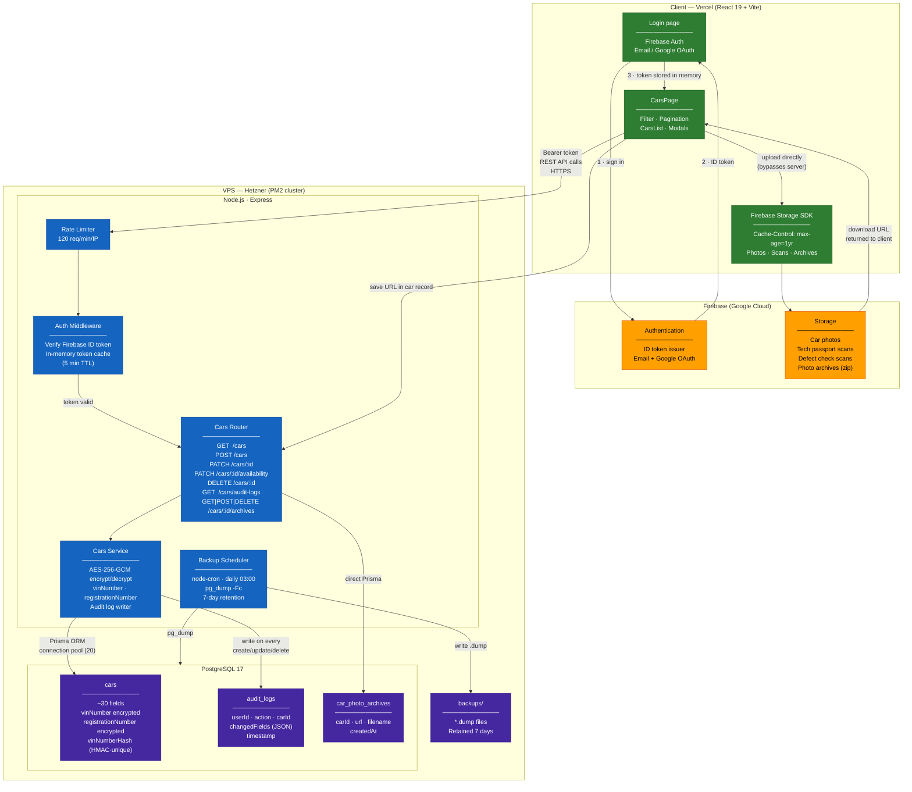

# Architecture Diagram — Car Dealer CRM



---

## Data Flow Summary

### Authentication
1. User signs in via Firebase Auth (email or Google)
2. Firebase returns a JWT ID token (valid 1 hour)
3. Token is attached as `Authorization: Bearer <token>` on every API request
4. Server middleware verifies the token against Google's public keys, caches result for 5 minutes

### Car Listing Request
1. Client sends `GET /cars?filters&page` with Bearer token
2. Rate limiter checks 120 req/min per IP
3. Auth middleware validates token (cache hit → no Google call)
4. Service decrypts `vinNumber` and `registrationNumber` from DB before returning

### Create / Edit Car
1. If files selected → uploaded directly from browser to Firebase Storage (server never touches binary data)
2. Firebase returns download URLs → merged into form payload
3. `POST /cars` or `PATCH /cars/:id` sent to server
4. Server encrypts sensitive fields, writes to DB, creates audit log entry

### File Asset Loading
- Firebase Storage URLs include `Cache-Control: public, max-age=31536000`
- Browser caches assets for 1 year; new upload = new unique URL, no stale cache risk

---

## Security Layers

| Layer | Mechanism |
|---|---|
| Transport | HTTPS (Let's Encrypt via Nginx) |
| Authentication | Firebase ID token on every request |
| Rate limiting | 120 req / min / IP (express-rate-limit) |
| Field encryption | AES-256-GCM — vinNumber, registrationNumber |
| VIN uniqueness | HMAC-SHA256 stored separately |
| DB access | Restricted `crm_app` user (planned) |
| Network | PostgreSQL bound to localhost only (planned) |
| Audit trail | Every write logged to audit_logs with userId + diff |
| Backups | Daily pg_dump, 7-day retention |
```
