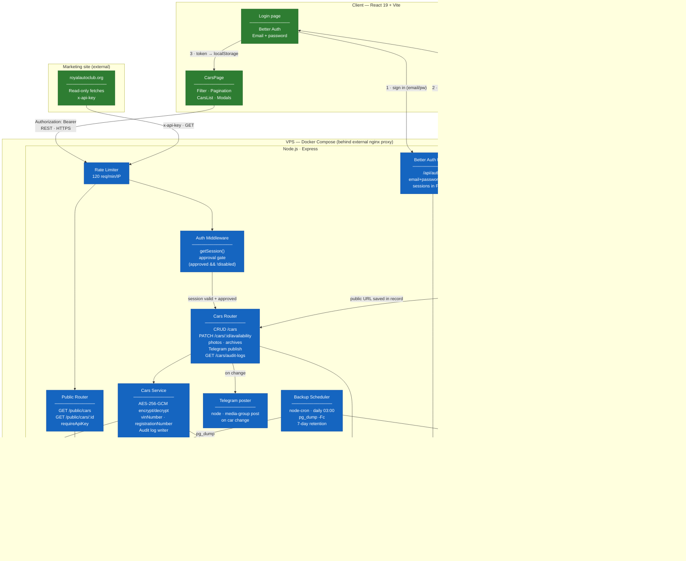

# Architecture Diagram — Car Dealer CRM


```mermaid
flowchart TB
    subgraph CLIENT["Client — React 19 + Vite"]
        direction TB
        Login["Login page\n─────────────\nBetter Auth\nEmail + password"]
        CarsPage["CarsPage\n─────────────\nFilter · Pagination\nCarsList · Modals"]
        Uploads["Upload UI\n─────────────\nPhotos · Scans · Archives\nsent to server (multipart)"]
    end

    subgraph SITE["Marketing site (external)"]
        PublicClient["royalautoclub.org\n─────────────\nRead-only fetches\nx-api-key"]
    end

    subgraph VPS["VPS — Docker Compose (behind external nginx proxy)"]
        direction TB

        subgraph EXPRESS["Node.js · Express"]
            RateLimit["Rate Limiter\n120 req/min/IP"]
            BetterAuth["Better Auth handler\n─────────────\n/api/auth/*\nemail+password · bearer\nsessions in Postgres"]
            AuthMW["Auth Middleware\n─────────────\ngetSession()\napproval gate\n(approved && !disabled)"]
            Router["Cars Router\n─────────────\nCRUD /cars\nPATCH /cars/:id/availability\nphotos · archives\nTelegram publish\nGET /cars/audit-logs"]
            PublicRouter["Public Router\n─────────────\nGET /public/cars\nGET /public/cars/:id\nrequireApiKey"]
            Service["Cars Service\n─────────────\nAES-256-GCM encrypt/decrypt\nvinNumber · registrationNumber\nAudit log writer"]
            PhotoUpload["Photo pipeline\n─────────────\nmulter → sharp optimize\n→ putObject (S3)"]
            Telegram["Telegram poster\n─────────────\nnode · media-group post\non car change"]
            Backup["Backup Scheduler\n─────────────\nnode-cron · daily 03:00\npg_dump -Fc\n7-day retention"]
        end

        subgraph PG["PostgreSQL 17"]
            T_CARS["cars\n─────────────\n~50 fields\nvinNumber encrypted\nregistrationNumber encrypted\nvinNumberHash (HMAC·unique)"]
            T_AUDIT["audit_logs\n─────────────\nuserId · action · carId\nchangedFields (JSON)"]
            T_PHOTOS["car_photos / car_photo_archives\n─────────────\nordered gallery · zip archives"]
            T_AUTH["user / session / account\n─────────────\nBetter Auth tables\n+ approved / disabled"]
        end

        subgraph MINIO["MinIO (S3-compatible)"]
            Bucket["bucket\n─────────────\nCar photos\nTech passport / defect scans\nPhoto archives (zip)\nserved public, immutable 1yr"]
        end

        BACKUPS["backups/\n─────────────\n*.dump files\nRetained 7 days"]
    end

    %% Auth flow
    Login -- "1 · sign in (email/pw)" --> BetterAuth
    BetterAuth -- "2 · session + set-auth-token" --> Login
    Login -- "3 · token → localStorage" --> CarsPage

    %% API calls
    CarsPage -- "Authorization: Bearer\nREST · HTTPS" --> RateLimit
    RateLimit --> AuthMW
    AuthMW -- "session valid + approved" --> Router
    Router --> Service
    Service -- "Prisma ORM" --> T_CARS
    Service -- "write on every\ncreate/update/delete" --> T_AUDIT
    Router --> T_PHOTOS
    BetterAuth --> T_AUTH

    %% Public API
    PublicClient -- "x-api-key · GET" --> RateLimit
    RateLimit --> PublicRouter
    PublicRouter -- "toPublicCar()\nstrips sensitive fields" --> T_CARS

    %% File uploads (through the server)
    Uploads -- "multipart upload" --> PhotoUpload
    PhotoUpload -- "putObject" --> Bucket
    Bucket -- "public URL saved in record" --> Router

    %% Telegram
    Router -- "on change" --> Telegram

    %% Backup
    Backup -- "pg_dump" --> PG
    Backup -- "write .dump" --> BACKUPS

    %% Styles
    classDef minio fill:#C72E29,color:#fff,stroke:#8A1F1B
    classDef vps fill:#1565C0,color:#fff,stroke:#0D47A1
    classDef client fill:#2E7D32,color:#fff,stroke:#1B5E20
    classDef db fill:#4527A0,color:#fff,stroke:#311B92

    class Bucket minio
    class RateLimit,BetterAuth,AuthMW,Router,PublicRouter,Service,PhotoUpload,Telegram,Backup vps
    class Login,CarsPage,Uploads,PublicClient client
    class T_CARS,T_AUDIT,T_PHOTOS,T_AUTH,BACKUPS db
```

---

## Data Flow Summary

### Authentication
1. User signs in with email + password via Better Auth (`POST /api/auth/*`).
2. Better Auth creates a session (stored in Postgres) and returns a bearer token in the `set-auth-token` response header.
3. The client stores the token in `localStorage` (`crm_bearer_token`) and attaches it as `Authorization: Bearer <token>` on every API request.
4. Server middleware resolves the session with `auth.api.getSession()`, then enforces the approval gate.

### Approval gate
- New sign-ups start `approved: false` (pending). An admin approves them via the Users panel.
- Emails listed in `ADMIN_EMAILS` are auto-approved on creation and bypass the gate.
- `requireAuth` rejects sessions that are unapproved (`pending_approval`) or disabled (`account_disabled`); admins are exempt.

### Car Listing Request
1. Client sends `GET /cars?filters&page` with the bearer token.
2. Rate limiter checks 120 req/min per IP.
3. Auth middleware validates the session + approval.
4. Service decrypts `vinNumber` and `registrationNumber` from the DB before returning.

### Create / Edit Car
1. Files are uploaded **through the server** as multipart form data (`POST /cars/upload-photos`, `/cars/upload-file`).
2. The server optimizes images with `sharp` and stores them in MinIO/S3 via `putObject`; the public object URL is returned.
3. `POST /cars` or `PATCH /cars/:id` carries the URLs plus the rest of the payload.
4. Server encrypts sensitive fields, writes to the DB, and creates an audit-log entry.
5. If Telegram is configured and the car is not archived, the poster creates/edits a channel media-group post.

### Public marketing API
- The marketing site fetches `GET /public/cars` and `/public/cars/:id` with a static `x-api-key` (or Bearer) from `PUBLIC_API_KEYS`.
- `requireApiKey` allows GET/HEAD only; `toPublicCar()` strips sensitive fields (VIN, registration, internal pricing) before responding.

### File Asset Loading
- Objects are written with `Cache-Control: public, max-age=31536000, immutable`.
- The browser caches assets for a year; a new upload = a new unique key, so there is no stale-cache risk.

---

## Security Layers

| Layer | Mechanism |
|---|---|
| Transport | HTTPS (Let's Encrypt via the external nginx proxy) |
| Authentication | Better Auth session + bearer token on every request |
| Authorization | Approval gate (`approved && !disabled`); admin allowlist |
| Public API | Static API keys (`PUBLIC_API_KEYS`), read-only (GET/HEAD) |
| Rate limiting | 120 req / min / IP (express-rate-limit + nginx `limit_req`) |
| Field encryption | AES-256-GCM — `vinNumber`, `registrationNumber` |
| VIN uniqueness | HMAC-SHA256 (`vinNumberHash`) stored separately, unique |
| DB access | `crm_app` user; Postgres reachable only on the internal Docker network |
| Object storage | MinIO on the internal network; bucket served read-only via public URL |
| Audit trail | Every write logged to `audit_logs` with userId + field diff |
| Backups | Daily `pg_dump -Fc`, 7-day retention |
```
